# certbot with lambda

run container > s3 > certbot[container] > cname > alb:80 > target group > lambda > certbot[container]

## 1. Infrastructure & Flow Diagram

## 2. Sequence Diagram - Challenge Process

## 3. Component Interaction Diagram

```mermaid
graph LR
    subgraph "Container Environment"
        CB[Certbot Container]
        AK[Account Key]
        JWK[JWK Extract]
    end
    
    subgraph "AWS Services"
        S3[(S3 Bucket)]
        ALB{ALB :80}
        Lambda["🔧 Lambda Function<br/>Challenge Responder"]
    end
    
    subgraph "External"
        LE[🔒 Let's Encrypt]
        Domain[🌐 Your Domain]
    end
    
    CB -.->|register| LE
    CB -->|extract| AK
    AK -->|format| JWK
    JWK -->|upload| S3
    CB -->|request cert| LE
    
    LE -->|validate| Domain
    Domain -->|CNAME| ALB
    ALB -->|route| Lambda
    Lambda <-->|fetch JWK| S3
    Lambda -->|token.thumbprint| ALB
    ALB -->|response| LE
    
    LE -.->|issue cert| CB
    CB -->|store cert| S3
    
    style CB fill:#bbdefb
    style LE fill:#f8bbd9
    style Lambda fill:#fff9c4
    style S3 fill:#c8e6c9
    style ALB fill:#ffcdd2
```

